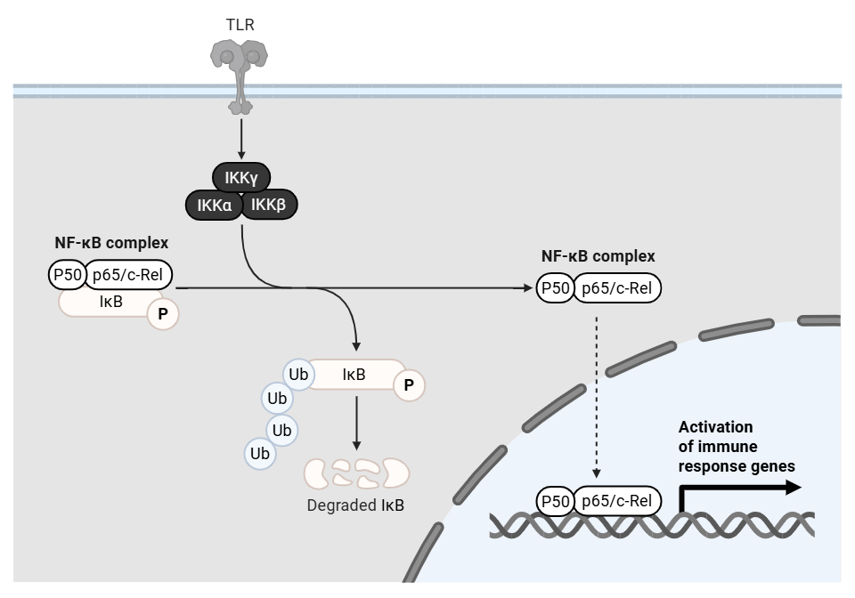

# Modelovanie dynamiky NF-κB v bunke

  

**Nukleárny faktor kappa B (NF-κB)** je kľúčový transkripčný faktor regulujúci široké spektrum bunkových procesov, vrátane imunitnej odpovede, apoptózy a bunkového cyklu. 
Aktivácia NF-κB prebieha prostredníctvom signálnej dráhy zahŕňajúcej degradáciu inhibičného proteínu IκB, čo umožňuje translokáciu NF-κB do jadra a aktiváciu cieľových génov. 
Tento systém vykazuje dynamické oscilácie, ktoré sú kritické pre správne fungovanie bunky. Pri disregulácií dochádza k navodeniu patologických stavov, ako je rakovina alebo chronický zápal.

---

**Cieľom práce** je vytvoriť matematický model regulácie NF-κB v bunke pomocou sústavy obyčajných diferenciálnych rovníc. 
Model by mal simulovať dynamickú hladinu NF-κB, najmä jeho oscilácie v závislosti od negatívnej spätnej vazby jeho inhibičných regulačných proteínov.

---

## Obsah repozitára

🗂️ **notebooks**  
- 🗂️ **Basal_model** — zjednodušený (bazálny) model
  - `00_basal_system.ipynb` — Jupyter notebook s implementáciou a spustením simulácie bazálneho modelu.
  - `parametre.py` — definícia parametrov bazálneho modelu (rýchlosti transkripcie, degradácie, väzby a pod.).  
  - `rovnice.py` — implementácia sústavy obyčajných diferenciálnych rovníc popisujúcich dynamiku bazálneho modelu.  
  - `simulacia.py` — skript pre spustenie numerických simulácií bazálneho modelu 

- 🗂️ **CytoNuclei_model** — model so zohľadnením kompartmentalizácie bunky (cytoplazma ↔ jadro)
  - `00_model.ipynb` — hlavný Jupyter notebook s implementáciou a simuláciami kompartmentálneho modelu.   
  - `CytoNuc_parametre.py` — definícia parametrov pre kompartmentálny model  
  - `CytoNuc_rovnice.py` — implementácia diferenciálnych rovníc so zohľadnením transportu medzi cytoplazmou a jadrom a tvorby komplexov.  
  - `CytoNuc_simulacia.py` — skript spúšťajúci simulácie kompartmentálneho modelu  

